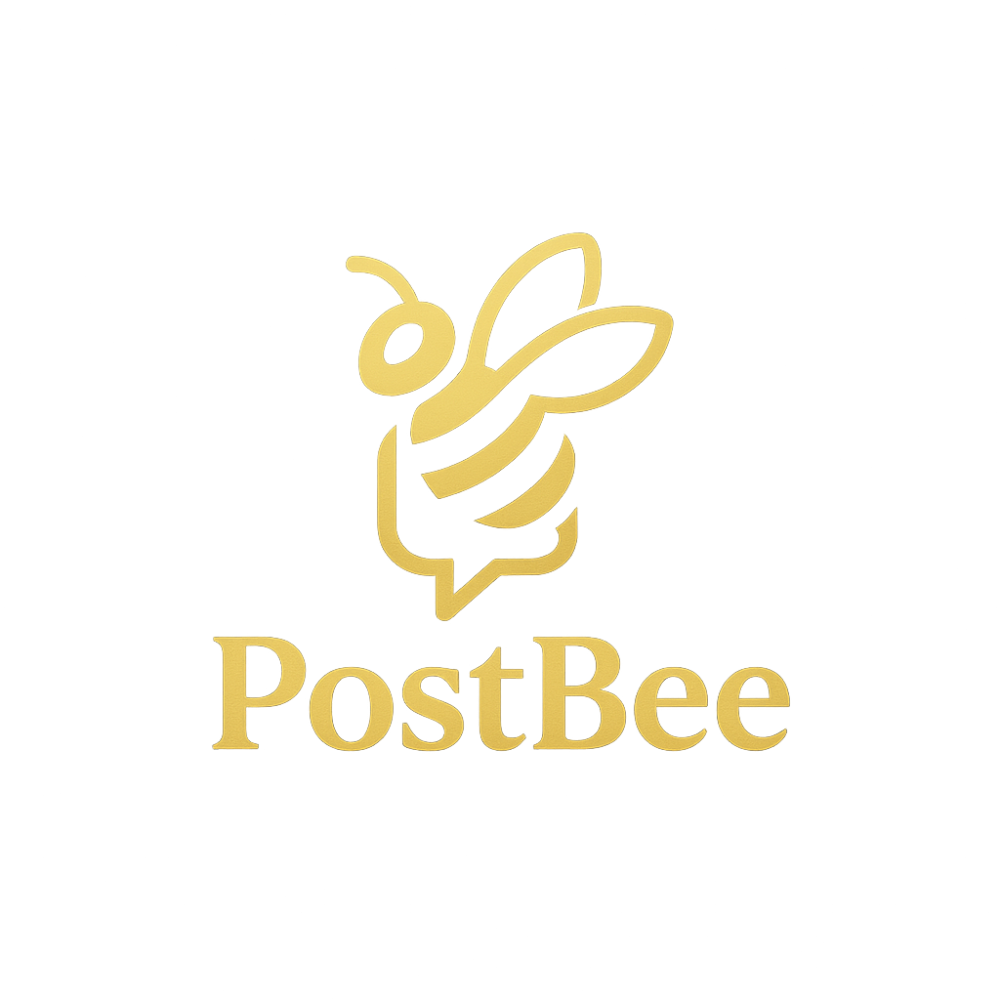

<div align="center">
  
  <h1>PostBee UI Library</h1>
  <p><a href="https://www.npmjs.com/package/@postbee/postbee-ui-lib"></a>
    
    
    
    
    
    
    
    
    
    
    
    
    
    
    
    
    
    </p>
</div>

> A modern, accessible React component library powered by Tailwind CSS 4, Radix Primitives, and TypeScript. Batteries included: theming, icons, tests, and Storybook docs.

--------------------------------------------------------------------------------

# ✨ Features

- 🔒 **Type-safe**: Written in TypeScript with ESM and CJS builds
- ♿ **Accessible primitives**: Built on Radix UI
- 🎨 **Theming**: Tailwind CSS 4 tokens and ready-to-use styles
- ✅ **Well-tested**: Vitest + Testing Library
- 📚 **Storybook**: Local docs for components and tokens

## 📦 Installation

```bash
npm install @postbee/postbee-ui-lib
```

## 🚀 Quick Start

1) Import the base styles once in your app entry:

```typescript
// e.g., src/main.tsx or _app.tsx
import '@postbee/postbee-ui-lib/styles';
```

2) Use components:

```tsx
import { Button, Icon, Paragraph } from '@postbee/postbee-ui-lib';

export default function Example() {
  return (
    <div>
      <Paragraph>Welcome to PostBee UI</Paragraph>
      <Button>Click me</Button>
      <Icon name="checkmark" />
    </div>
  );
}
```

## 🎨 Tailwind Configuration (optional)

You can extend your Tailwind setup with our exported configuration and design tokens.

```typescript
// tailwind.config.ts
import baseConfig from '@postbee/postbee-ui-lib/tailwind.config.ts';

export default {
  // your app config ...
  presets: [baseConfig],
};
```

## 🧩 Available Components

- 👤 **Avatar**
- 🔘 **Buttons**: Button, IconButton, TextButton, ToggleButton, LikeButton, CommentsButton, CopyButton
- 💬 **Dialog**
- 📝 **Fields**: Input, Textarea, ErrorMessage
- 🎯 **Icon** (with built-in SVG set)
- 🔗 **Link**
- 🏷️ **Logo**
- 📑 **Tabs**
- ✍️ **Typography**: Heading, Label, Paragraph

Import from the package root:

```typescript
import {
  Avatar,
  Button,
  IconButton,
  TextButton,
  ToggleButton,
  LikeButton,
  CommentsButton,
  CopyButton,
  Dialog,
  Input,
  Textarea,
  ErrorMessage,
  Icon,
  Link,
  Logo,
  Tabs,
  Heading,
  Label,
  Paragraph,
} from '@postbee/postbee-ui-lib';
```

## 🛠️ Scripts

- 🚀 **dev**: Vite playground for local development
- 📖 **storybook**: Run Storybook locally on port 6006
- 📦 **build**: Create ESM/CJS builds and copy styles/config
- 🧪 **test**: Run unit tests (Vitest)
- 🔍 **lint**: Lint, type-check, and unused check

```bash
npm run dev
npm run storybook
npm run build
npm test
npm run lint
```

## 📋 Peer Dependencies

- ⚛️ **React**: 19
- 🌐 **React DOM**: 19
- 🎨 **Tailwind CSS**: 4

## 💻 Tech Stack

- ⚛️ **Framework**: React 19 + TypeScript
- 🎨 **Styling**: Tailwind CSS 4, Design Tokens
- ♿ **A11y Primitives**: Radix UI (Avatar, Dialog, Tabs)
- ⚡ **Build**: Vite 7
- 📚 **Docs**: Storybook 10
- 🧪 **Testing**: Vitest, @testing-library/react, jsdom
- 🔍 **Lint/Format**: ESLint, Prettier
- 🚀 **Release**: semantic-release

## 📖 Local Storybook Docs

Run Storybook to explore components and tokens:

```bash
npm run storybook
```

## 🔗 Storybook URL

- 🏠 **Local**: `http://localhost:6006` (after running `npm run storybook`)
- 🌐 **Hosted (Vercel)**: [https://postbee-ui.vercel.app](https://postbee-ui.vercel.app/?path=/docs/docs-intro--docs)

## 🤝 Contributing

1. 🌿 Create a feature branch
2. 🔨 Build and test locally
3. ✨ Add stories and tests for new components
4. 📤 Submit a PR

## 📚 References

- ⚛️ **React**: `https://react.dev`
- 🎨 **Tailwind CSS v4**: `https://tailwindcss.com`
- ♿ **Radix UI**: `https://www.radix-ui.com/primitives`
- 📖 **Storybook**: `https://storybook.js.org`
- 🧪 **Testing Library**: `https://testing-library.com/docs/react-testing-library/intro`
- ⚡ **Vitest**: `https://vitest.dev`
- 🚀 **semantic-release**: `https://semantic-release.gitbook.io/semantic-release`

--------------------------------------------------------------------------------

## 👥 Contributors

Made with ❤️ by PostBee Team. All trademarks are property of their respective owners.

- 👨‍💻 [@ricardo17coelho](https://github.com/ricardo17coelho)
- 👨‍💻 [@vco-80](https://github.com/vco-80)
